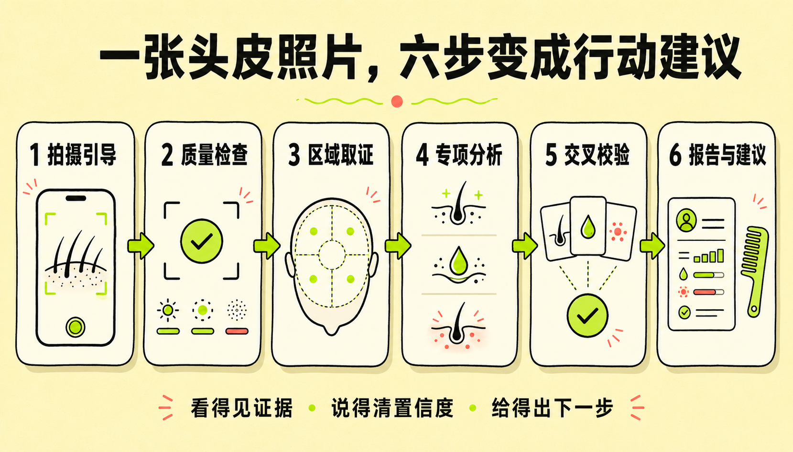
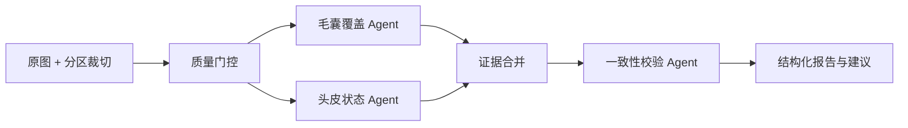

<p align="center">
  
</p>

<h1 align="center">秃了么</h1>

<p align="center">
  <strong>一张照片，读懂今天的头皮。</strong><br />
  手机拍摄或专业设备采集，观察毛囊覆盖、炎症迹象、油脂平衡与清洁状态。
</p>

---

## 这是什么？

头皮不会说话，但会留下线索。

“秃了么”把一张头皮照片变成一条可以解释的观察链：先检查图片能不能看，再从不同区域提取视觉证据，让两个专项 Agent 独立分析，最后交给校验 Agent 核对分数、证据与置信度。

它不会把一张糊图硬说成结论，也不会把视觉估计包装成医疗诊断。

<p align="center">
  
</p>

## 用户可以做什么？

- **手机拍摄**：分开头发后上传照片，获得日常头皮快照。
- **专业设备模式**：支持镜检或带标尺图片，为后续量化校准预留入口。
- **即时质量检查**：在浏览器中检查分辨率、曝光、清晰度与高光比例。
- **五项健康观察**：毛囊密度、炎症平稳度、油脂平衡、清洁状态、发丝均匀度。
- **证据与限制并列**：每项分数同时展示可见证据、置信度和局限。
- **行动建议**：把结果转成梳理、清洁观察和固定机位复拍计划。
- **零配置演示**：没有 API Key 也能体验完整流程；配置后自动切换到真实视觉模型。

## Agent Harness



### 为什么不是“把照片丢给模型看一眼”？

1. **输入先过关**  
   客户端先计算分辨率、平均亮度、暗部/高光比例与拉普拉斯清晰度。明显模糊或过曝时直接建议重拍。

2. **多区域取证**  
   原图连同左、中、右三个裁切区域一起分析，降低某一个局部区域带来的偏差。

3. **专项 Agent 并行**  
   - 毛囊覆盖 Agent：关注 `density` 与 `shaft_uniformity`
   - 头皮状态 Agent：关注 `inflammation`、`sebum` 与 `flaking`

4. **交叉校验**  
   校验 Agent 重新查看图片，核对专项结论是否真的有视觉证据。冲突时降低置信度，而不是强行投票。

5. **严格结构化输出**  
   Responses API 使用 JSON Schema 限制输出结构，前端只渲染经过约束的字段。

6. **健康安全边界**  
   普通照片中的毛囊密度与油脂状态被明确标注为“视觉代理”；系统不命名疾病、不推荐药物，并对需要线下确认的可见信号单独提示。

## 指标定义

| 指标 | 当前图像能力 | 不会声称 |
| --- | --- | --- |
| 毛囊密度 | 可见毛囊口、发丝覆盖与区域均匀度 | 无标尺时的真实 follicles/cm² |
| 炎症迹象 | 可见泛红、刺激、破损信号 | 疾病名称或临床诊断 |
| 油脂平衡 | 表面高光、发根成束与区域分布 | 真实皮脂分泌量 |
| 清洁状态 | 可见鳞屑与堆积 | 低分辨率下不可见的微小鳞屑 |
| 发丝均匀度 | 发丝粗细与断裂观感 | 单张图片中的长期变化结论 |

## 本地运行

环境要求：Node.js 22.13+

```bash
npm install
cp .env.example .env.local
npm run dev
```

打开本地地址后，可以直接点击“先用示例体验完整流程”。

要启用真实多模态分析，在 `.env.local` 中设置：

```bash
OPENAI_API_KEY=your_key_here
OPENAI_MODEL=gpt-5.6
```

不要把 API Key 提交到 GitHub，也不要在浏览器端调用模型。

## 推理接口

前端把压缩后的原图与三个区域裁切发送到：

```text
POST /api/analyze
```

服务端调用 OpenAI Responses API，并设置：

- `store: false`
- 多张 `input_image`
- `detail: high`
- Structured Outputs / JSON Schema
- 两个并行专项分析 + 一次最终校验

如果没有配置 `OPENAI_API_KEY`，或者模型调用暂时失败，接口会返回带有 `mode: "demo"` 标记的演示报告，页面不会把它伪装成真实图像结论。

## 项目结构

```text
app/
├── api/analyze/route.ts       # 图像分析接口
├── scalp-check.tsx            # 上传、质量检查、进度与报告交互
├── page.tsx                   # 产品页面
└── globals.css                # 青柠视觉系统与响应式样式
lib/scalp-agent/
├── orchestrator.ts            # 多 Agent 编排与 Responses API
├── prompts.ts                 # 专项提示词与安全边界
├── schema.ts                  # 产品与报告类型
└── demo.ts                    # 无密钥演示回退
public/
├── tuleme-logo.png
├── tuleme-hero.png
└── tuleme-flow.png
```

## 验证

```bash
npm run lint
npm test
```

## 重要说明

本项目用于头皮健康管理与趋势观察，不构成医疗诊断。若出现疼痛、渗出、出血、持续加重的红斑或短期快速脱发，请咨询皮肤科专业人员。

